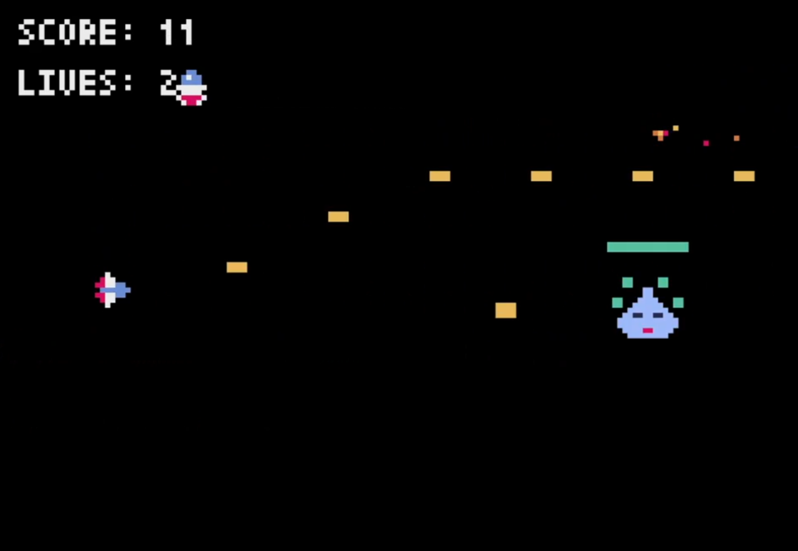

# Pyxel シューティングゲーム README

## ゲーム概要

### 基本情報

横スクロールシューティングゲームです。プレイヤーは宇宙船を操作して敵を倒しながら、中ボスとラスボスに挑戦します。レトロな8ビットグラフィックスとサウンドで、昔ながらのアーケードシューティングゲームの雰囲気を楽しめます。



### ゲームの目的

-   敵を倒してスコアを獲得する
-   スコア10で出現する中ボスを倒す
-   スコア30で出現するラスボスを倒してゲームクリアを目指す
-   3つのライフを使い切る前にできるだけ高いスコアを獲得する

### 操作方法

-   **矢印キー**: 上下左右に移動
-   **スペースキー**: 弾を発射（長押しで連射可能）
-   **Rキー**: ゲームオーバー/クリア時にリスタート

## ゲーム要素

### プレイヤーキャラクター

-   3機のライフを持っています
-   敵や敵の弾に当たるとライフが減少します
-   被弾後は一時的な無敵時間があり、点滅で表示されます
-   ライフが0になるとゲームオーバーとなります

### 敵キャラクター

**通常の敵**

-   画面右から左へ移動します
-   ランダムな速度（1.0-2.0の範囲）で動きます
-   30フレームごとにランダムな高さから出現します
-   弾に当たると消滅し、スコア+1となります

**中ボス（スコア10で出現）**

-   HP: 20
-   倒すとスコア+10
-   画面右側で上下に揺れながら移動します
-   3方向に弾を発射する攻撃を行います

**ラスボス（スコア30で出現）**

-   HP: 40
-   倒すとスコア+20とゲームクリア
-   4つのフェーズを持ち、180フレームごとに切り替わります
-   各フェーズで異なる移動パターンと攻撃パターンを持ちます:
    1.  8の字移動と扇状の弾幕
    2.  ジグザグ移動とプレイヤー追尾弾
    3.  円運動と螺旋状の弾幕
    4.  急速な直線移動と全方向ランダム弾

### 武器と弾システム

-   プレイヤーの弾はスペースキーで発射できます
-   長押しで連射可能（5フレームごとに発射）
-   弾は直線的に右方向へ移動します
-   ボスの弾は複数のパターンがあり、複雑な軌道で移動します

### エフェクト

-   キャラクターが破壊されると爆発エフェクトが発生します
-   パーティクルが四方八方に飛び散ります
-   無敵時間中はプレイヤーが点滅します
-   ボスのHPバーが表示されます

## 技術情報

### 開発環境

-   **言語**: Python 3.x
-   **フレームワーク**: Pyxel 1.5以上
-   **フレームレート**: 30FPS（Pyxelのデフォルト）

### ファイル構成

-   `main.py`: ゲームのメインスクリプト
-   `assets.pyxres`: ゲームで使用するスプライトやサウンドを含むリソースファイル
-   `README.md`: このドキュメント

## 実行方法

1.  Pythonとpyxelをインストール:

```sh
Copypip install pyxel

```

2.  リポジトリをクローン:

```sh
Copygit clone https://github.com/あなたのユーザー名/シューティングゲーム.git
cd シューティングゲーム

```

3.  ゲームを実行:

```sh
Copypython main.py

```

## その他

### クレジット

-   **開発**: Yasuhiro Hayano
-   **フレームワーク**:  [Pyxel](https://github.com/kitao/pyxel)  by Takashi Kitao
